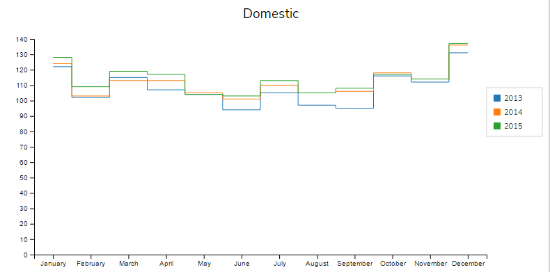
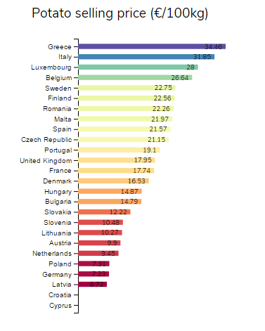
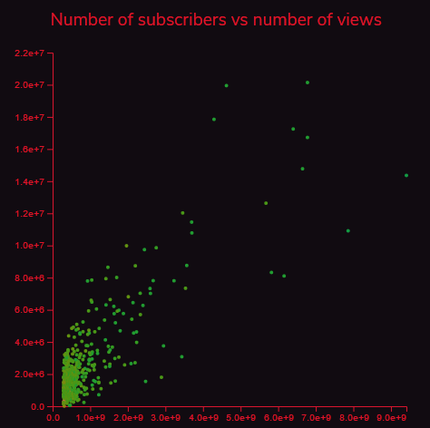
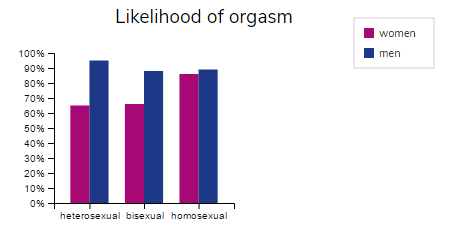
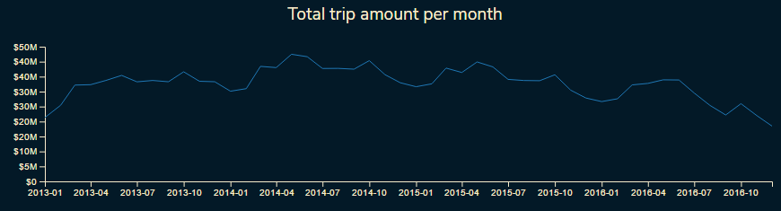

# LDD3

## Description
Yes, it is exactly what you think: another charting library based on [d3](https://d3js.org).

This one was built using [d3](https://d3js.org) v4 and [TypeScript](https://www.typescriptlang.org).

This is currently work in progress (like, really), but I hope some people can find it useful, to see how d3 and typescript can be used, or simply just want to throw some charts on a page without having to deal with the whoe d3 stack.

Being from the .NET world, I used an OOP style for creating the controls and charts, based on `class` syntax.

## Installing

To install ldd3 and get started, simply issue
```
npm install --save ldd3
```

## Library structure
The library currently comprises two types of controls:

### Axes

### Charts

All the examples below are extracted from my taking part to the [Makeover Monday](http://www.makeovermonday.co.uk/) challenge. Code used to generate these charts is available in [this repository](https://github.com/Ledragon/MakeOverMonday2017).

#### CategoricalLinearChart

#### HorizontalBarChart

#### LinearLinearChart

#### MultiCategoricalChart

#### TimeLinearChart


## Usage

I will try to motivate myself to publish some bl.ocks demonstrating how to use these charts. Check [this repository](https://github.com/Ledragon/MakeOverMonday2017) for examples in the meanwhile.

API usage is described in the [wiki](https://github.com/Ledragon/ldd3/wiki).
